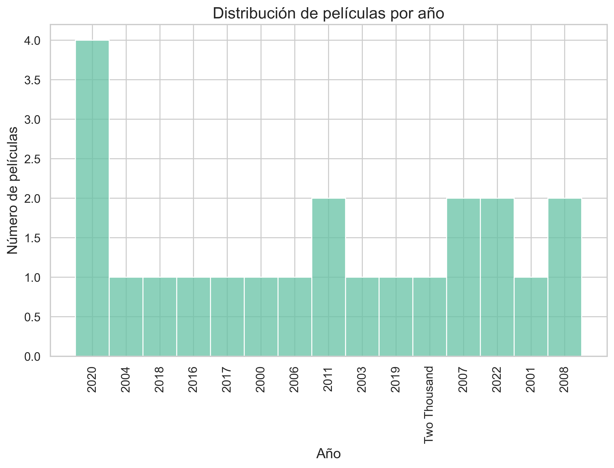
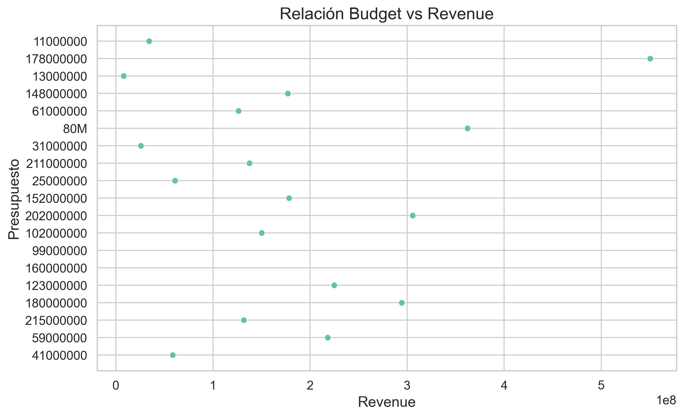
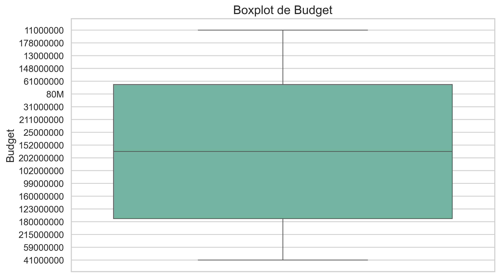
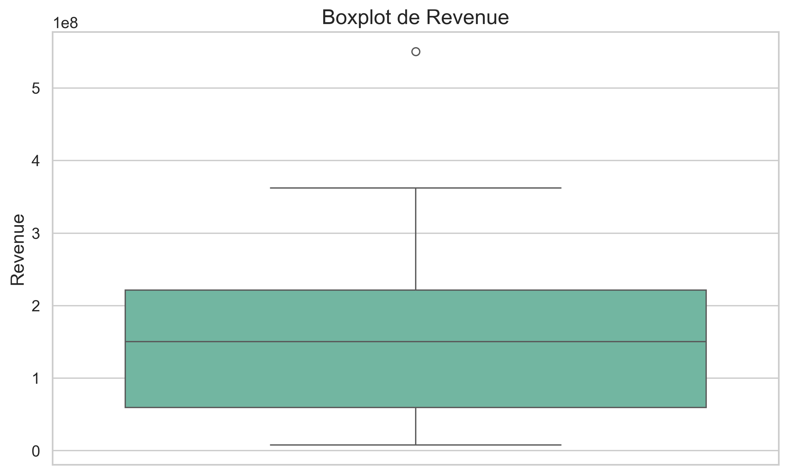
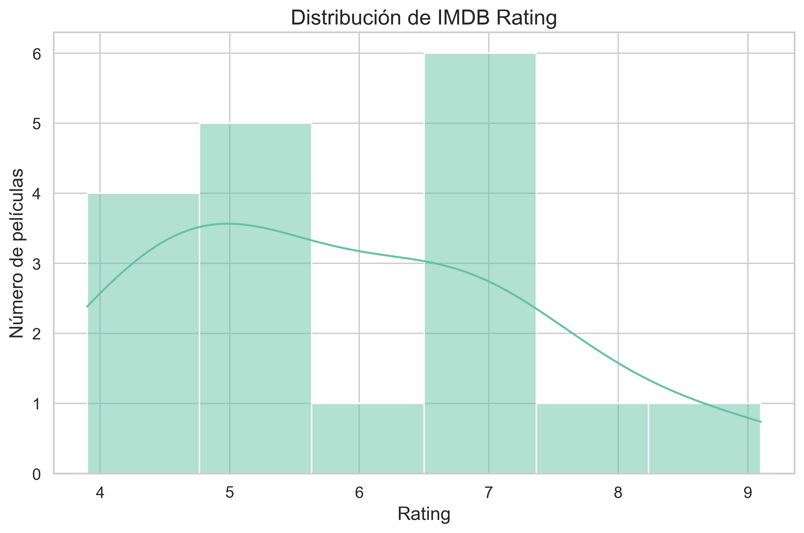
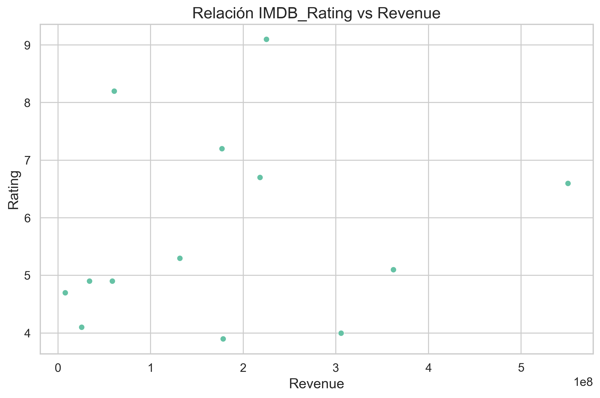
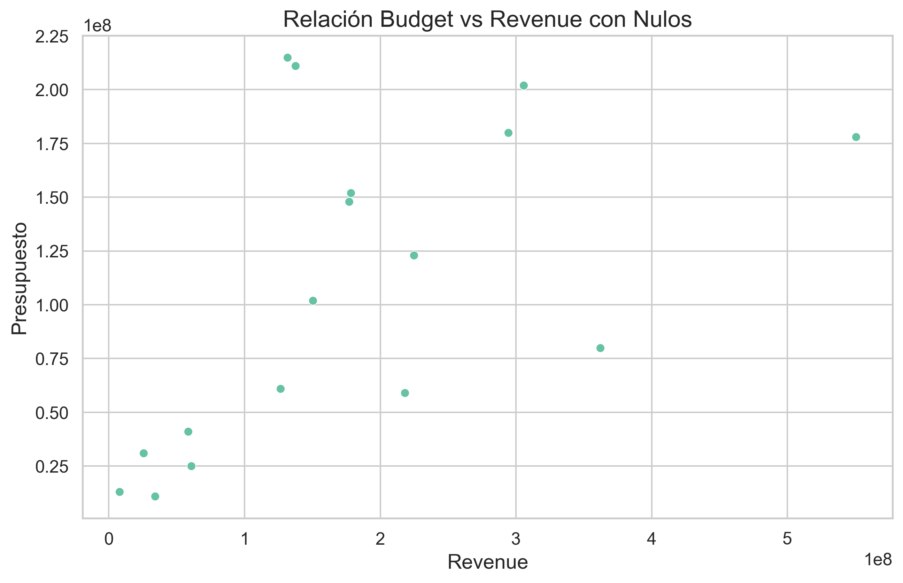
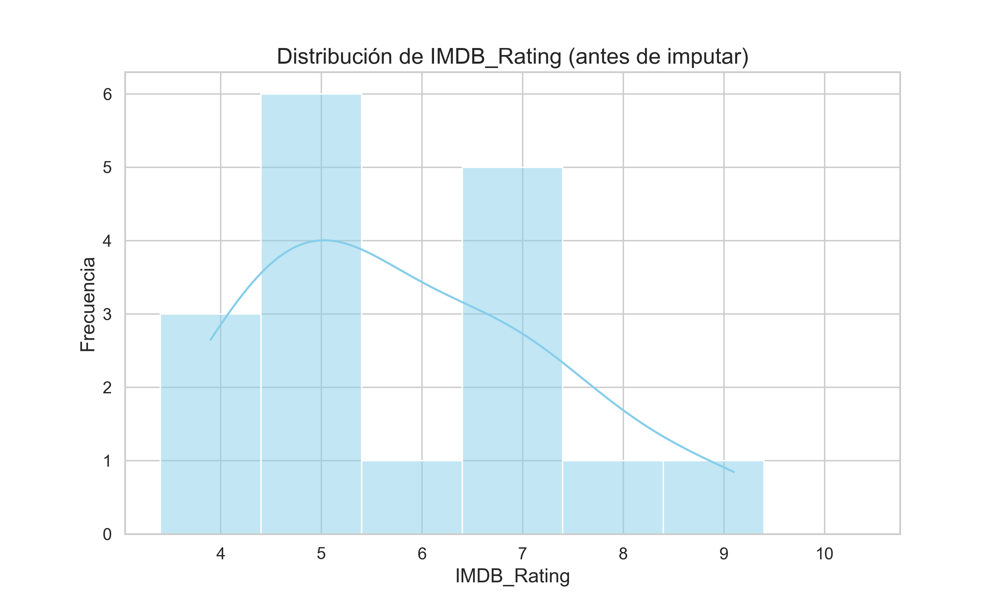
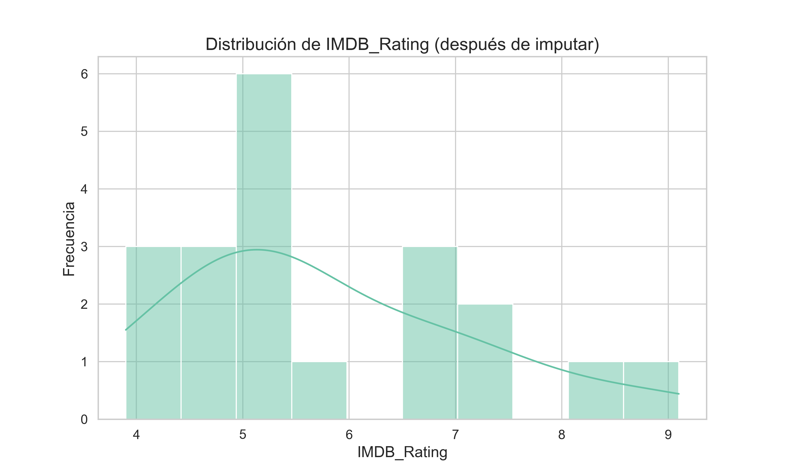

# Reto Adopta Un Junior: Análisis Movies Dataset
Análisis exploratorio y visualización de un dataset de películas como parte del reto de datos de Adopta un Junior.

## Configuración inicial

Se importan las librerías necesarias para manipulación de datos (`pandas`, `numpy`, `re`, `requests`), conversión de strings a números (`word2number`) y visualización (`matplotlib`, `seaborn`).

Se configuran:  
- Pandas para mostrar todas las columnas y evitar notación científica (opcional).  
- Seaborn y Matplotlib para un estilo uniforme, paleta de colores y tamaños de títulos/etiquetas.  
- Ignorar warnings innecesarios para mantener el Notebook limpio.

Esta configuración asegura un entorno consistente y profesional para el análisis exploratorio, limpieza y visualización de los datos.

## 1. Introducción
Este proyecto consiste en analizar un dataset de películas con información sobre años, género, budget, revenue y valoración en IMDB.  
El objetivo es limpiar, explorar y completar los datos faltantes para extraer insights y preparar un dataset listo para análisis posteriores, sin perder de vista la posible escalabilidad del proyecto, teniendo en cuenta que este dataset es reducido.

---

## 2. Dataset
- Fuente: CSV proporcionado por el reto "Adopta un Junior".
- Columnas principales:
  - `Title`: Título de la película
  - `Genre`: Género
  - `Year`: Año de lanzamiento
  - `Budget`: Presupuesto
  - `Revenue`: Ingresos generados
  - `IMDB_Rating`: Valoración en IMDB

> Tamaño: 22 filas 

---

## 3. Análisis Exploratorio (EDA)
Se realizó un análisis preliminar con la función `carga_eda()`para entender la distribución de los datos y detectar posibles problemas.  
- Revisiones realizadas:
  - `value_counts()` para variables categóricas
  - `describe()` para variables numéricas
  - Detección de valores nulos
  - Detección de duplicados

### Visualizaciones exploratorias realizadas previa limpieza:
- **Distribución de películas por año**: algunos valores estaban en formato string (por ejemplo, "Two Thousand"). Se decidió convertir a fecha y extraer solo el año para un análisis correcto.

- **Relación Budget vs Revenue**: los valores de Budget estaban desordenados y en formatos mixtos (por ejemplo, "80M"). Se planificó convertirlos a valores numéricos y normalizar unidades (miles, millones) para analizar la relación.

- **Boxplots de Budget y Revenue**: se detectaron outliers en la columna Revenue, lo que indica valores atípicos que podrían influir en el análisis.

  

- **Distribución de IMDB_Rating**: se realizó un histograma para observar la frecuencia de las valoraciones y un scatterplot relacionando IMDB_Rating con Revenue. No se observó una relación clara entre la valoración y los ingresos.

---

## 4. Duplicados, Limpieza y Transformaciones

### 4.1 Detección y eliminación de duplicados:  
  Durante el EDA se identificaron dos filas duplicadas en el dataset.  
  - Se realizó un `value_counts()` sobre la columna `Title` (que funciona como identificador único).  
  - Se confirmaron los duplicados usando `df_movies.duplicated(keep=False).sort_values("Title")`.  
  - Se eliminaron los duplicados aplicando `df_movies.drop_duplicates(inplace=True)`.  
  - Finalmente, se verificó que los cambios se aplicaron correctamente comprobando la forma del DataFrame con `.shape`.

### 4.2 Year
- Se convirtió string a número usando la función `text_to_num()` con la librería `word2number`.  
- Se transformó a tipo datetime y se extrajo el año (`dt.year`).

### 4.3 Budget
- Limpiado con la función `clean_budget()`.  
- Detecta mediante la librería Regex `Mm` y `Kk` y convierte a int (millones y miles respectivamente).  
- Valores no convertibles se devuelven como `NaN`.

### 4.5 OMdB API ("Genre", "IMDB_Rating", "Revenue")

Durante el EDA se identificaron valores nulos en las columnas `IMDB_Rating`, `Revenue` y `Genre`.  

  Para completar estos datos se utilizó la API de OMDb (requiere una `API_KEY`). Se creó la función `fill_omdb()` que realiza los siguientes pasos:  
  1. Itera por las filas de las columnas con valores nulos.  
  2. Cuando detecta un `NaN`, llama a la API buscando el título de la película.  
  3. Si la API responde correctamente y encuentra la película:  
      - Rellena únicamente los datos que están vacíos y existen en la respuesta de la API (no sobreescribe datos ya presentes).  
      - Si la API no contiene información sobre ese campo, se mantiene `NaN`.  
  4. Si no se encuentra la película, se imprime un aviso.  
  5. Si ocurre algún error de conexión con la API, también se imprime un mensaje de error.  

- Antes de aplicar la función, se revisó el porcentaje de nulos.  
- Se aplicó la función `fill_omdb()` al DataFrame.  
- Finalmente, se volvió a comprobar el porcentaje de nulos para verificar los cambios.

**Aunque en un dataset con pocos datos, como es el caso, la cantidad de informacion recopilada no fue mucha, se realizó pensando en la escalabilidad del proyecto**

---

## 5. Imputación final de Nulos
- `Genre`: valores nulos completados con la API o mantenidos como `NaN` si no se encontraron.Se convirtieron desùés en "Unknown".

- `Revenue`: imputación por mediana según la relación con Budget (ratio). 

Se comparó la relación antes y después de la imputación de nulos para comrpobar que nose distorsionaba.
|  |  |
| -------------- | --------------- |
|| |

- `IMDB_Rating`: imputación por mediana global (en caso de datasets más grandes se recomienda agrupando por género)

|  |  |
| -------------- | --------------- |
|| |

---

## 6. Visualizaciones finales

## 7. Conclusiones
- Existe una relación positiva entre Budget y Revenue.  
- La limpieza y transformación de Year, Budget y Revenue permitió un análisis más confiable.  
- La consulta a OMDb completó información faltante de IMDB_Rating y Genre, dejando el dataset listo para análisis futuros o visualizaciones más avanzadas.  

---

## 8. Cómo ejecutar el proyecto
1. Clonar el repositorio  
2. Instalar dependencias: `pip install -r requirements.txt`  
3. Ejecutar notebooks en el orden:
   - `01_EDA.ipynb`  
   - `02_Limpieza_y_Nulos.ipynb`  

> Las imágenes generadas se guardan en la carpeta `./images/`.
