# Reto Adopta Un Junior: Análisis Movies Dataset
Análisis exploratorio y visualización de un dataset de películas como parte del reto de datos de Adopta un Junior.

## Configuración inicial

Se importan las librerías necesarias para manipulación de datos (`pandas`, `numpy`, `re`, `requests`), conversión de strings a números (`word2number`) y visualización (`matplotlib`, `seaborn`).

Se configuran:  
- Pandas para mostrar todas las columnas y evitar notación científica (opcional).  
- Seaborn y Matplotlib para un estilo uniforme, paleta de colores y tamaños de títulos/etiquetas.  
- Ignorar warnings innecesarios para mantener el Notebook limpio.

Esta configuración asegura un entorno consistente y profesional para el análisis exploratorio, limpieza y visualización de los datos.

## 1. Introducción
Este proyecto consiste en analizar un dataset de películas con información sobre años, género, budget, revenue y valoración en IMDB.  
El objetivo es limpiar, explorar y completar los datos faltantes para extraer insights y preparar un dataset listo para análisis posteriores, sin perder de vista la posible escalabilidad del proyecto, teniendo en cuenta que este dataset es reducido.

---

## 2. Dataset
- Fuente: CSV proporcionado por el reto "Adopta un Junior".
- Columnas principales:
  - `Title`: Título de la película
  - `Genre`: Género
  - `Year`: Año de lanzamiento
  - `Budget`: Presupuesto
  - `Revenue`: Ingresos generados
  - `IMDB_Rating`: Valoración en IMDB

> Tamaño: 22 filas 

---

## 3. Análisis Exploratorio (EDA)

Se realizó un análisis preliminar con la función `carga_eda()`para entender la distribución de los datos y detectar posibles problemas.  
- Revisiones realizadas:
  - `value_counts()` para variables categóricas
  - `describe()` para variables numéricas
  - Detección de valores nulos
  - Detección de duplicados

---
### Visualizaciones exploratorias realizadas previa limpieza:

| Gráfico | Insight |
|---------|---------|
| 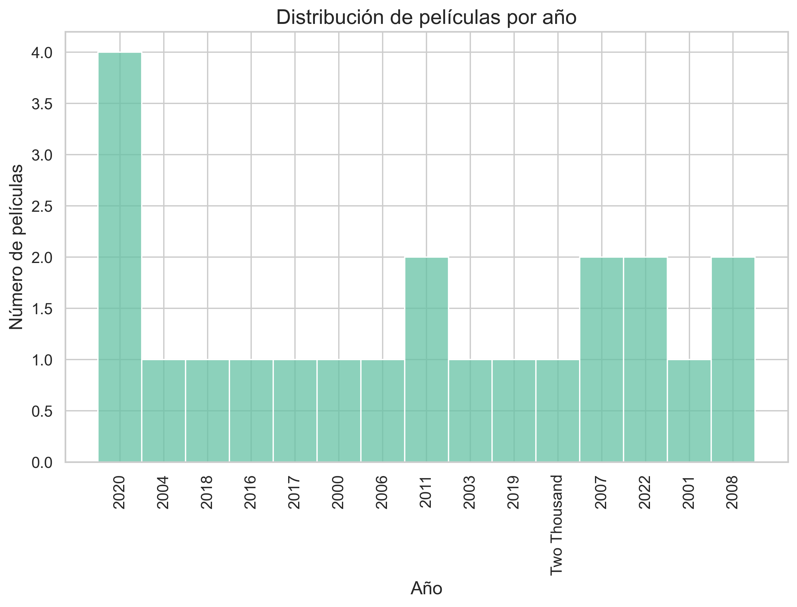 | Algunos valores estaban en formato string ("Two Thousand") y se convirtieron a años. El año con más películas es **2020**. |
| 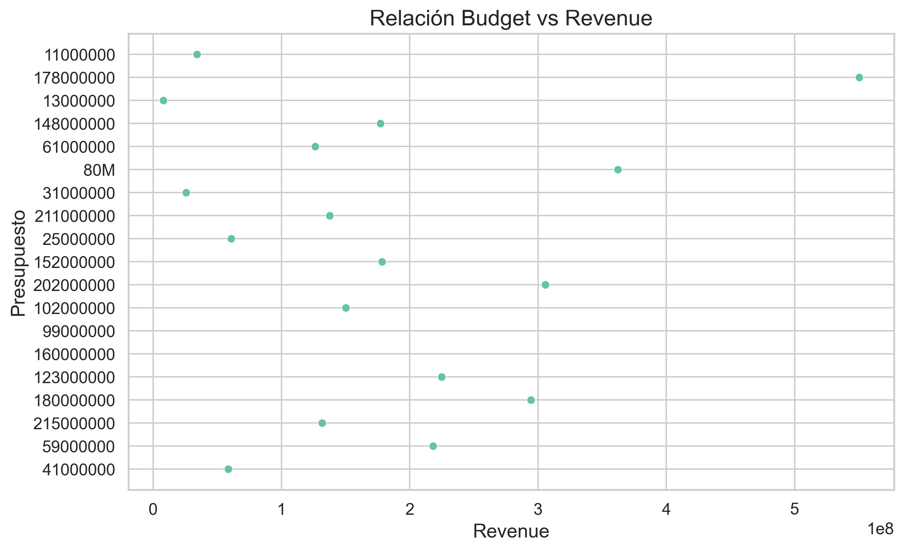 | Los valores de Budget estaban desordenados y en formatos mixtos. Se planificó normalizar unidades (miles, millones) para analizar la relación. |
| 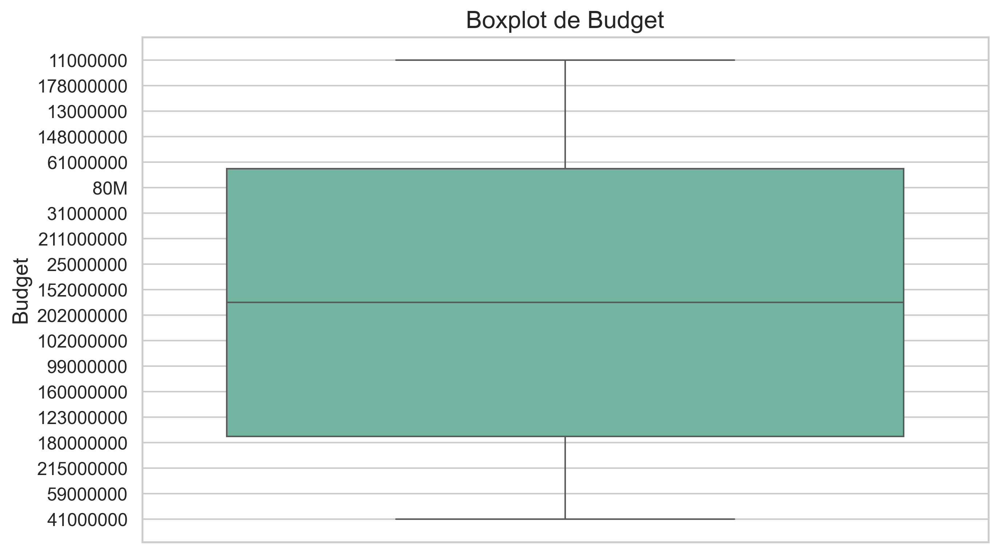 | Se detectan valores en formato mixto ("80M") que hay que limpiar. |
| 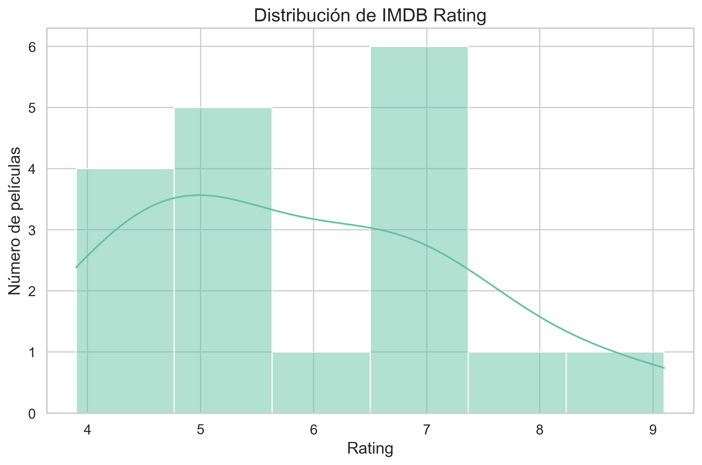 | Se observa la distribución de IMDB_Rating. La mayoría de películas se concentran en valores medios, con pocas películas con valoraciones extremas. |
| 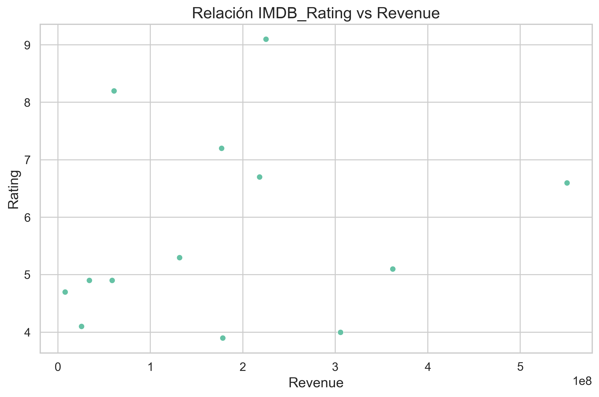 | No se observa una relación clara entre IMDB_Rating y Revenue; se volverá a comprobar una vez los datos estén limpios. |

## 4. Duplicados, Limpieza y Transformaciones

### 4.1 Duplicados
Durante el EDA se detectaron **2 filas duplicadas** en el dataset.

- Se realizó un `value_counts()` sobre la columna `Title` (identificador único).  
- Se confirmaron los duplicados usando `df_movies.duplicated(keep=False).sort_values("Title")`.  
- Se eliminaron con `df_movies.drop_duplicates(inplace=True)`.  
- Se verificó con `.shape` que los cambios se aplicaron correctamente.

---

### 4.2 Year
- Conversión de strings a números usando la función `text_to_num()` (librería `word2number`).  
- Transformación a tipo datetime y extracción del año (`dt.year`) para análisis correcto.

### 4.3 Budget
- Limpieza con la función `clean_budget()`.  
- Detecta las letras `M/m` y `K/k` con Regex y convierte los valores a int (millones y miles).  
- Valores no convertibles se transforman en `NaN`.

### 4.5 OMDb API
Se identificaron valores nulos en las columnas: `IMDB_Rating`, `Revenue` y `Genre`.

- Se creó la función `fill_omdb()` que:  
  1. Itera sobre filas con nulos.  
  2. Consulta la API de OMDb por el título de la película.  
  3. Rellena únicamente los datos vacíos que existen en la respuesta.  
  4. Mantiene `NaN` si la API no devuelve información.  
  5. Imprime un aviso si la película no se encuentra o si hay error de conexión.  

- Se revisó el porcentaje de nulos antes y después de aplicar la función.

**Nota:** En datasets pequeños, la cantidad de información obtenida es limitada, pero la función está pensada para escalabilidad.

---

## 5. Imputación final de Nulos

| Columna | Estrategia de imputación | Visualización |
|---------|--------------------------|---------------|
| **Genre** | Valores nulos completados con la API o mantenidos como `NaN` si no se encontraron, luego se etiquetan como `"Unknown"` | 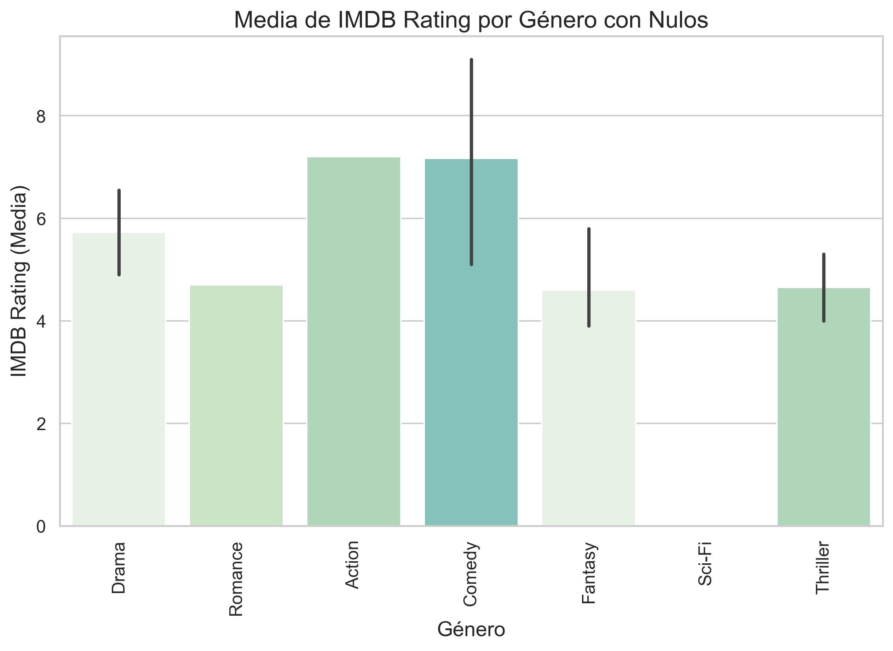   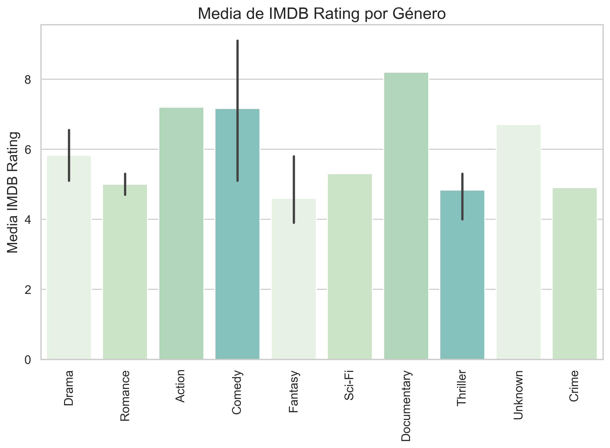|
| **Revenue** | Imputación por mediana usando la relación con Budget (`ratio`) | 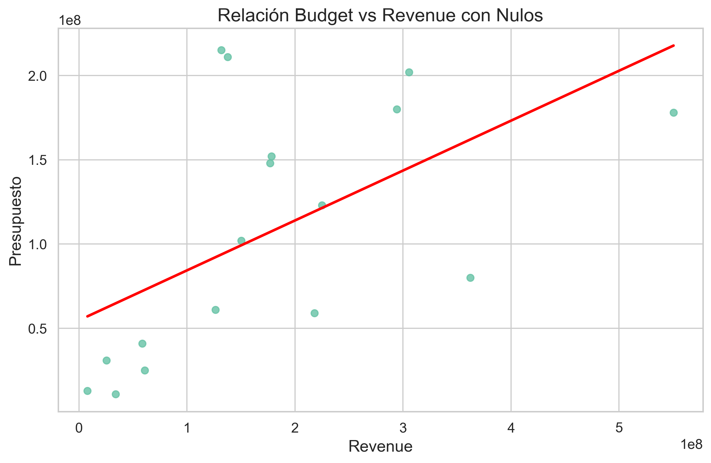    |
| **IMDB_Rating** | Imputación por mediana global (en datasets grandes se recomienda por género) | 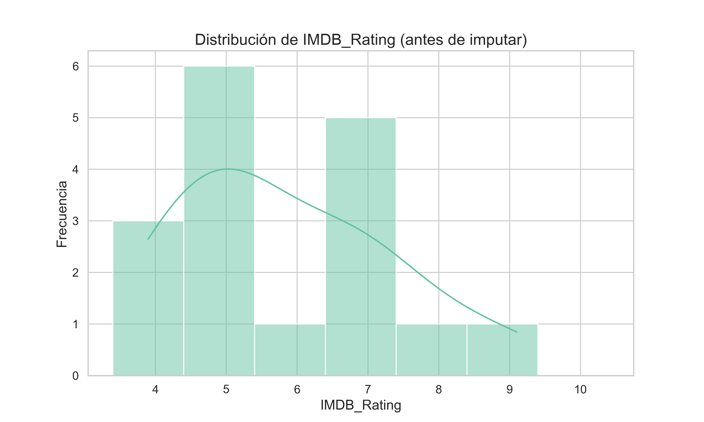   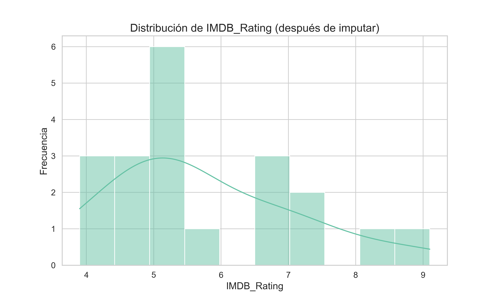 |

---

## 6. Visualizaciones y Conclusiones finales

A continuación se muestran los principales insights obtenidos tras el análisis exploratorio de los datos y las visualizaciones.

⚠️ **Nota**: El dataset es reducido, por lo que los resultados deben interpretarse con cautela. Con un conjunto de datos más completo, los insights podrían variar significativamente.

---

### 6.1 Evolución de Budget y Revenue por año
- **Tendencia decreciente** de presupuesto y recaudación entre 2000 y 2022.
- Confirma la **relación positiva** identificada en la matriz de correlación.

|  |  |
| -------------- | --------------- |
|||

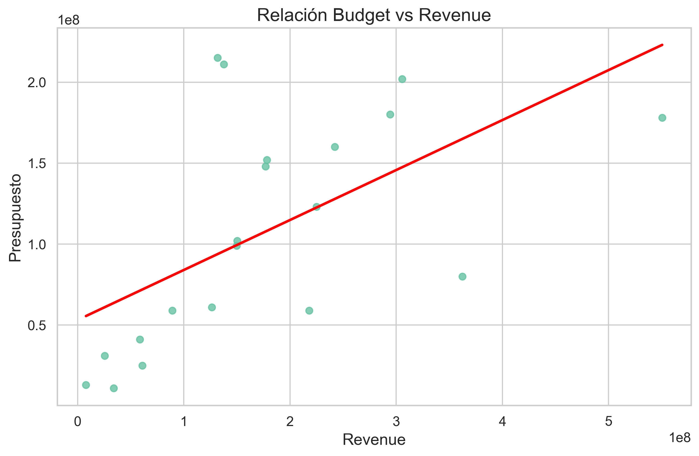

---

### 6.2 Top 5 películas
- **60% de coincidencia** entre Top 5 de mayor presupuesto y Top 5 de mayor recaudación (correlación 0.58).  
- **No existe relación** clara entre valoración IMDb y recaudación.

|  |  |
| -------------- | --------------- |
|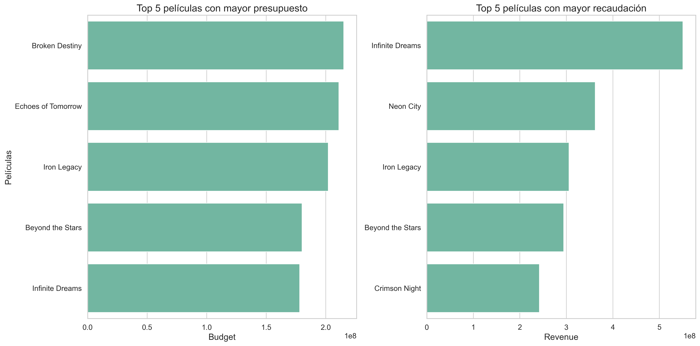|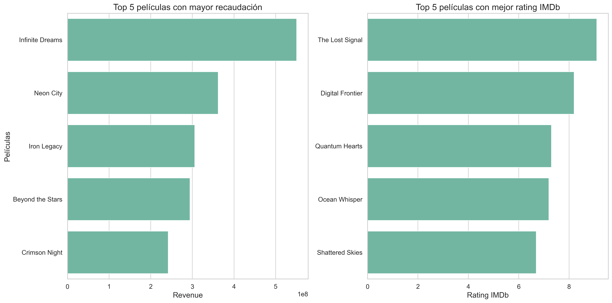|

---

### 6.3 Géneros
- **Drama, Comedy y Thriller** son los géneros con más películas y mayor recaudación absoluta.  
- **Documentary, Action y Comedy** presentan las valoraciones promedio más altas.

|  |  |
| -------------- | --------------- |
|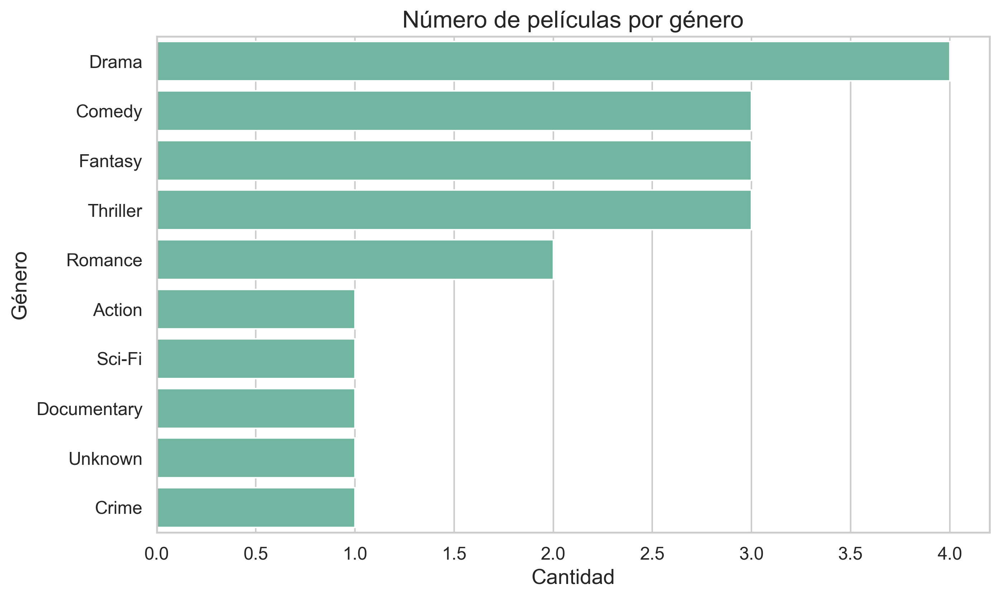|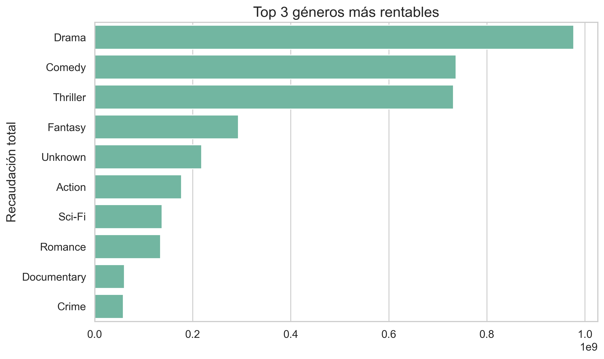|

---

### 6.4 IMDb Rating
- **Año con más películas**: 2020.  
- **Mejor valoración media**: 2003 (8.2), seguida de 2016 y 2007 (7.2).  
- **Peor valoración media**: 2019 (3.9).  
- **Valoración media global**: 5.77.  
- La mayoría de películas tienen valoraciones medias (4.8 a 5.8), pocas tienen valoraciones extremas.

|  |  |
| -------------- | --------------- |
|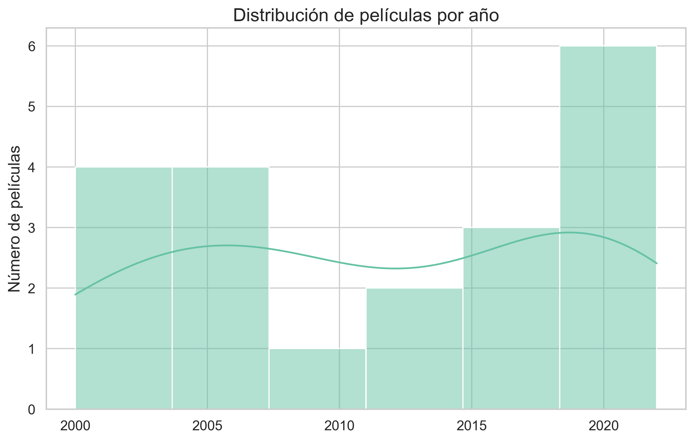|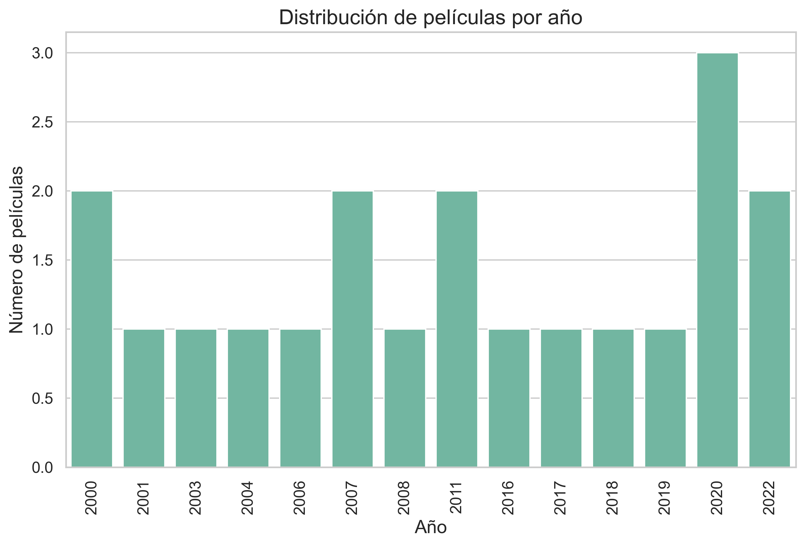|

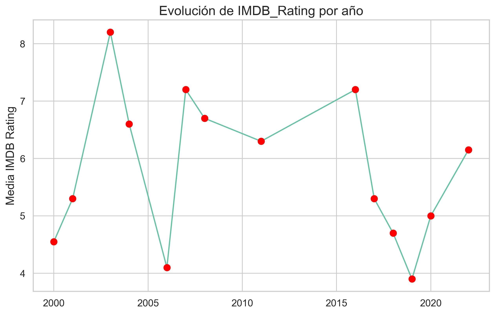  
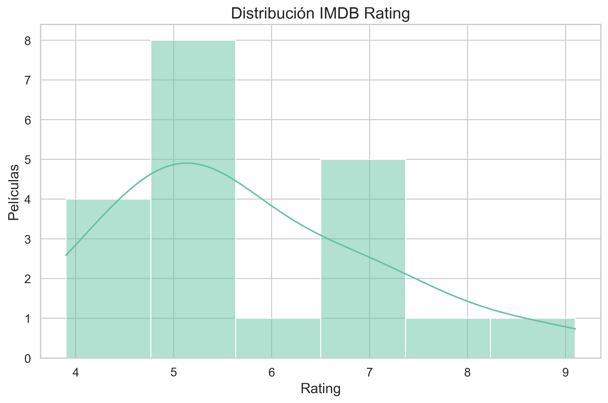

## 7. Next Steps
- Identificar las películas con su código IMDb para facilitar referencias y consultas externas.
- Ampliar el análisis con un dataset más grande para validar los insights.
- Crear un dashboard en Tableau que resuma los hallazgos principales.

---

## 8. Cómo ejecutar el proyecto
1. Clonar el repositorio  
2. Instalar dependencias: `pip install -r requirements.txt`
3. Configurar API Key:
- Es necesario obtener una API Key de OMDb (gratuita para uso básico).
- Puedes solicitarla en http://www.omdbapi.com/apikey.aspx
- Una vez obtenida, introduce tu API Key en la variable API_KEY dentro del código antes de ejecutar los notebooks (`02_limpieza_nulos.ipynb`).
4. Ejecutar notebooks en el orden:
   - `01_eda.ipynb`  
   - `02_limpieza_y_nulos.ipynb`  
   - `03_visualizaciones_y_conclusiones.ipynb`

> Durante la ejecución, las imágenes generadas se guardan automáticamente en las carpetas:
- `./images/` → visualizaciones exploratorias y gráficas del EDA.
- `./reports/` → visualizaciones finales utilizadas en las conclusiones.

